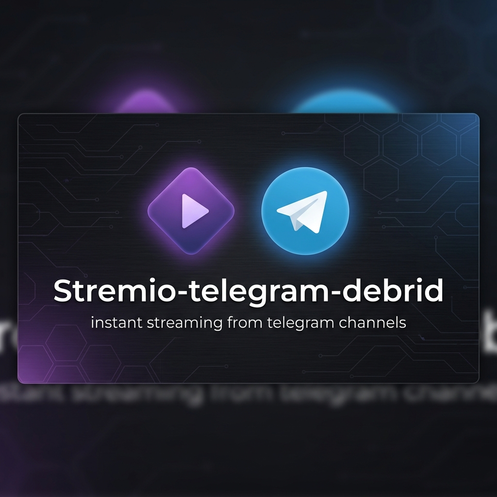
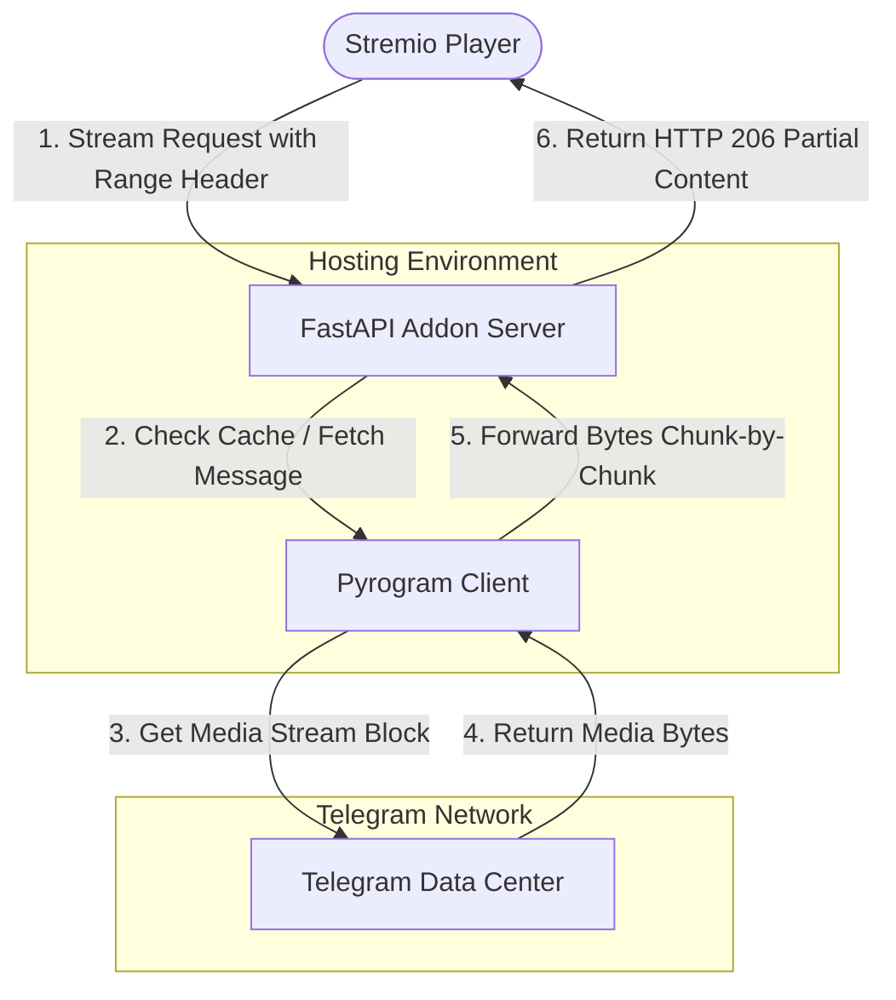

# Telegram Stremio Addon



[](LICENSE)
[](https://github.com/SunilRoy-dev/stremio-telegram-debrid/stargazers)
[](https://github.com/SunilRoy-dev/stremio-telegram-debrid/network/members)


Stream video, audio, and subtitle files directly from your private Telegram storage channels inside Stremio. This addon serves as a high-speed on-the-fly streaming HTTP proxy (fully supporting Range Requests for instant seek/scrubbing) that integrates your private Telegram channel into your personal Stremio library.

### Why I built this
I store my personal media files on a private Telegram channel. I wanted a way to play them directly on my TV through Stremio without paying for Debrid links or downloading the files first.so I wrote this lightweight, database-free Python script to serve as a fast streaming proxy with subtitle loading and instant skipping.

Contributions and bug reports are welcome! If you encounter issues, feel free to open a GitHub Issue, or submit a Pull Request with your improvements. All pull requests will be reviewed and merged accordingly.

> [!NOTE]
> **Show Your Support!** ⭐
> If you find this project useful, please **leave a star on the repository** before you fork, clone, or deploy it. Your stars help keep this project active and maintained!

---

## 🚀 Quick Start (For Beginners)

Here is a simplified step-by-step roadmap to get the addon running on your phone or computer in less than 5 minutes:

| Step | Action | Where to do it |
| :--- | :--- | :--- |
| **1. Fork the Project** | Click **Fork** at the top of this GitHub repository to copy it to your own GitHub account. | GitHub (this webpage) |
| **2. Get Keys** | Go to [my.telegram.org](https://my.telegram.org) and generate your 'API_ID' and 'API_HASH' keys (see [Setup Help](#1-how-to-get-telegram-api-id--api-hash)). | Telegram Website |
| **3. Get Session** | Run the Python script on [Computer](#how-to-generate-user_session_string-locally) or [Mobile](#how-to-generate-user_session_string-on-mobile-no-computer-needed) to get your 'USER_SESSION_STRING'. | Local computer or Mobile Phone |
| **4. Deploy** | Choose a hosting platform (e.g., Koyeb, Render, Railway, or Hugging Face) and deploy the addon (see [Deployment Options](#one-click-deploy--setup-options)). Enter your environment variables in the settings. | Hosting Provider |
| **5. Install** | Copy the manifest URL of your deployed app and paste it into the 'Add-ons' section of Stremio (see the [Stremio Installation Guide](#how-to-install-in-stremio)). | Stremio App |

### Setup Helpers:
* **How to get Telegram API Keys**:
  1. Go to [my.telegram.org](https://my.telegram.org), log in using your Telegram phone number (in international format, e.g., `+1234567890`), and enter the confirmation code sent to your Telegram app.
  2. Click **API development tools**.
  3. Fill in the **App title** and **Short name** (these can be anything, e.g. `tgaddon`). You can leave other fields blank/default.
  4. Submit and copy your `api_id` and `api_hash`. (If you get an error saving, try turning off your VPN/adblocker, or use a private window).
* **How to find your Private Channel ID**:
  1. Create a channel in Telegram and set it to **Private**.
  2. To get the ID, log in to Telegram Web (`web.telegram.org`), click on your private channel, and check the URL in your browser. It should look like `https://web.telegram.org/a/#-1001234567890`. That 13-digit number starting with `-100` (e.g. `-1001234567890`) is your `TELEGRAM_CHANNEL_ID`.
  3. Alternatively, post a message in your channel, forward it to a bot like `@MissRose_bot` or `@username_to_id_bot`, and it will reply with the channel's ID.

---

## One-Click Deploy & Setup Options

Deploy your own instance of the Telegram Stremio Addon instantly using any of the services below:

| Platform | Deployment Type / Limitations | Deploy Button |
| :--- | :--- | :--- |
| **Hugging Face Spaces** | Paid/PRO Tier (Docker Spaces are no longer available on the Free Tier — Requires a PRO subscription) | [Manual Setup Guide](#hugging-face-spaces-setup-guide) |
| **Render** | Free Hobby Tier (5GB Bandwidth Limit & Auto-Sleeps) | [](https://render.com/deploy?repo=https://github.com/SunilRoy-dev/stremio-telegram-debrid) |
| **Koyeb** | Free Edge Tier (Continuous — Requires Card Verification) | [](https://app.koyeb.com/deploy?type=git&repository=github.com/SunilRoy-dev/stremio-telegram-debrid&branch=main&name=stremio-telegram-debrid) |
| **Heroku** | Paid / Eco Tier (Stable & Continuous, starts at $5/month) | [](https://www.heroku.com/deploy/?template=https://github.com/SunilRoy-dev/stremio-telegram-debrid) |
| **Railway** | Trial Tier (Limited Credits, approx. 500 hours/month) | [](https://railway.app/new/template?template=https://github.com/SunilRoy-dev/stremio-telegram-debrid) |
| **Zeabur** | Trial Tier (Limited Credits) | [](https://zeabur.com/templates/deploy?template=https://github.com/SunilRoy-dev/stremio-telegram-debrid) |
| **Google Colab** | Free Tier (Temporary Runtime — Exposes app via Ngrok tunnel) | [](https://colab.research.google.com/github/SunilRoy-dev/stremio-telegram-debrid/blob/beta/deployment/colab/deploy_colab.ipynb) |

*Please read the **[Deployment Platform Specs and Limitations](#deployment-platform-specs-and-limitations)** section below before selecting a hosting provider.*

---

## 🌟 Key Features Explained (Beginner-Friendly)

* **Smart Search & Quality Sorting**: 
  - *What it is:* When you search or click play in Stremio, the addon automatically finds the right files in your Telegram channel.
  - *How it helps:* It reads both your file names and message captions (supporting formats like `S01E01` or `1x01`) and sorts the video streams by quality (4K, 1080p, 720p) so you see the best choice first.
* **Auto-Refreshing Stream Links**: 
  - *What it is:* Telegram file links naturally expire after a few hours. If you pause a stream for a long time, the original link breaks.
  - *How it helps:* The addon automatically detects this and fetches a fresh download link from Telegram in the background, letting you resume playing smoothly without errors.
* **Buffering-Bypass (No Lag)**: 
  - *What it is:* Many deployment servers (like Hugging Face or Render) use proxies that try to download the entire video before sending it to you.
  - *How it helps:* The addon forces them to disable buffering (`X-Accel-Buffering: no`), meaning the video starts playing instantly in Stremio.
* **Stitched Split Streaming**: 
  - *What it is:* Telegram limits uploads to 2GB or 4GB. To bypass this, you might split a large video into parts (like `.001`, `.002`, or `part1`, `part2`).
  - *How it helps:* The addon automatically matches these parts and stitches them into a single, continuous virtual video stream in Stremio.
* **Smart Segment Filtering**: 
  - *What it is:* Prevents naming clashes between separate video parts (like Part 1 vs. Part 2) in your channel.
  - *How it helps:* It filters your channel search results so you only query and play the exact file segments you select.
* **ZIP Archive Streaming**: 
  - *What it is:* You can upload videos compressed inside a `.zip` file (or split ZIP parts) to your channel.
  - *How it helps:* The addon reads the ZIP contents and plays the video files directly in Stremio. *(Note: Fast-forwarding/seeking doesn't work for ZIP files because the server has to extract from the beginning to reach the seek point. Upload files directly as `.mp4`/`.mkv` for full seeking support!)*
* **Automatic Subtitles**: 
  - *What it is:* Subtitle files uploaded to your channel alongside the videos.
  - *How it helps:* The addon scans for matching subtitle files (`.srt`, `.vtt`, `.ass`) and automatically injects them into Stremio, mapping English, Spanish, or French tracks.
* **High-Speed Scrubbing & Seeking**: 
  - *What it is:* Supports range requests (`HTTP 206`), letting you ask for specific parts of a file.
  - *How it helps:* You can fast-forward or rewind instantly in external players like VLC or MPV without loading delays.
* **Zero Disk Usage**: 
  - *What it is:* In-memory chunk streaming.
  - *How it helps:* Your deployment server's hard drive is never used to store video chunks, which prevents storage limits from getting exceeded.
* **Fast Loading & Session Reuse**: 
  - *What it is:* Usually, downloading a file chunk opens a brand-new login channel to Telegram, which is slow and can get your account rate-limited.
  - *How it helps:* The addon uses a patched connection logic to reuse login channels, making video chunks load instantly and safely.
  - *Note for Bots:* This speed optimization requires a User Session (`USER_SESSION_STRING`). Standard Bots (`BOT_TOKEN`) cannot use connection caching, have strict 2GB file size limits, and may fail or time out on larger files. Using a User Session is highly recommended for a stable experience.
* **Modern Python Support**: 
  - *What it is:* Python 3.12 and newer versions changed how task loops run, which can cause older scripts to crash.
  - *How it helps:* The addon is fully optimized to run on the latest Python base configurations, making VPS or Docker deployments extremely stable without crashes.
* **Secure Access Control**: 
  - *What it is:* Locking your addon with a private password (`API_KEY`).
  - *How it helps:* Prevents unauthorized users from accessing your Stremio addon link and consuming your server bandwidth.
* **Play Logging**: 
  - *What it is:* Integration with a private Telegram channel.
  - *How it helps:* Sends live playback history reports (file name, time, source channel) directly to a personal log channel.

---

## Stitched Split Streaming

> [!NOTE]
> **Stitched Split Streaming is in an early experimental stage.**
> While the addon attempts to stitch split files together on the fly, this feature is highly experimental and may or may not work consistently depending on your media player's streaming logic.

If you have large media files (e.g., 4K HDR video backups) that exceed Telegram's file upload limits (2GB for bots, 4GB for user accounts), you can split them into smaller segments before uploading. The addon automatically detects, groups, and stitches them back together into a single virtual stream.

### Supported Split Formats
The addon parses standard split archive conventions including:
* **Numeric extensions**: `Video.mkv.001`, `Video.mkv.002`, `Video.mkv.003`...
* **Part indicators**: `Video.part1.rar`, `Video.part2.rar`, `Video.part3.rar`... (or `.part01.mkv`, `.part02.mkv`...)
* **Suffix delimiters**: `Video_part_1.mp4`, `Video_part_2.mp4`...

### How It Works Under the Hood
1. **Aggregation**: The catalog handler parses filename patterns and clusters split files together, presenting them as a single item with their total combined file size (e.g., `Stitch stream | 6.2 GB`).
2. **Dynamic Range Mapping**: When you press play or seek in Stremio, the addon maps the player's byte-range requests to the respective split files on the fly.
3. **In-Memory Sequential Access**: It downloads only the necessary segments from Telegram DCs and transitions between split messages seamlessly in memory, resulting in uninterrupted playback.

---

## ZIP File Support

> [!CAUTION]
> **ZIP streaming is NOT recommended for daily use.**
> Because streaming a video from a ZIP file requires downloading and extracting the archive in the background before playing, it is very resource-intensive, slow to start, and prone to timeouts. For the best streaming experience, always upload your files **directly as video files (e.g. `.mp4`, `.mkv`)** instead of archiving them.

You can upload a '.zip' file (or a split ZIP like '.zip.001', '.zip.002', etc.) to your Telegram channel. The addon will automatically look inside the ZIP, find all the video files, and list them in Stremio so you can play them directly!

### ⚠️ Important: Skipping/Seeking does NOT work for ZIPs
> [!IMPORTANT]
> **You cannot skip forward or rewind when playing videos that are inside ZIP files.**
> - **Why?** To skip to a certain part of a video inside a ZIP file, the server has to download and unpack the ZIP file from the very beginning up to that point. For large media files, this takes too much time, and your Stremio player will freeze or disconnect.
> - **Easy Fix**: If you want to skip/seek through your videos, **do not upload them in a ZIP file**. Upload them **directly as video files ('.mp4', '.mkv', etc.)** or as split video files ('.001', '.002', etc.), and seeking will work perfectly!


## 📂 Naming and Matching Guide

To help the addon find your uploaded videos, name your files or write your Telegram message captions using this clean format:

```text
[File Name] [Season/Episode Info] [Extra Tags].extension
```

### Simple Rules to Follow:

1. **Put Details in Filename or Caption**:
   - You can put your video title and episode details in the **file name**, the **message caption**, or **both**. The addon checks both to find your files!
2. **Easy Season & Episode Format**:
   - Write season and episode numbers in whatever format you prefer. Supported styles include:
     * **Standard**: `S01E01`, `s1e1`, `s01.e01`, `1x01`, `01x01`, `1x1`
     * **Text**: `Season 1 Episode 1`, `Temporada 1 Capitulo 1` (Spanish and other languages supported!)
     * **Episode Only**: `Ep 12`, `capitulo 12`, `[12]`, `- 12 -` (defaults to Season 1)
3. **Direct Video Messages Work Automatically**:
   - Videos posted directly to your Telegram channel work automatically, even if they don't have a `.mp4` or `.mkv` extension in their name.
4. **Extra Details at the End**:
   - Put extra details like resolution or audio at the end (for example: `My Video S01E02 [1080p] [Dual-Audio].mkv`).

---

## System Architecture

The diagram below shows how the addon behaves as a range-supported streaming proxy between Stremio and Telegram:



---

## Configuration Environment Variables

Configure these settings in your deployment dashboard or local `.env` file:

| Variable | Required | Description |
| :--- | :---: | :--- |
| `API_ID` | **Yes** | Your Telegram API ID from [my.telegram.org](https://my.telegram.org). |
| `API_HASH` | **Yes** | Your Telegram API Hash from [my.telegram.org](https://my.telegram.org). |
| `TELEGRAM_CHANNEL_ID` | **Yes** | Comma-separated list of private/public channel IDs or usernames (e.g. -1001234567890, @my_channel). |
| `BOT_TOKEN` | **Conditional** | Bot Token from `@BotFather` (required if `USER_SESSION_STRING` is not configured). |
| `USER_SESSION_STRING` | **Conditional** | Pyrogram Session String (highly recommended to bypass bot limits, see details below). |
| `API_KEY` | No | Add a secret key (e.g. `mykey123`) to secure your addon endpoint with `?api_key=mykey123`. |
| `ADDON_URL` | **Yes** | The public HTTP URL where your server is deployed (e.g. `https://myaddon.onrender.com`). |
| `LOG_CHANNEL_ID` | No | Telegram channel ID where play/stream logs are recorded. |
| `TIMEZONE` | No | Timezone for logs (e.g., `Asia/Kolkata`, `UTC+05:30`). Defaults to `UTC`. |
| `CACHE_TTL` | No | Cache duration in seconds for searches (default: `1800` [30 mins]). |

---

## Telegram Credentials: Bot vs. User Sessions

You can run this addon using either a standard Telegram Bot Token or a Pyrogram User Session String.

> [!IMPORTANT]
> **We highly recommend using a User Session (`USER_SESSION_STRING`) instead of a Bot Token.**
> Telegram Bots have strict download limitations, a strict file size limit (2GB maximum), and are easily rate-limited. This means bot-based streaming **may fail to load large files and might not work consistently**. Setting up a User Session string bypasses these limits, allows streaming files up to 4GB, provides faster download speeds, and offers a much more stable connection.

Review the differences below:

### 1. Telegram Bot (Bot Token)
- **Limitations**: Telegram enforces a strict **2GB size limit** on all bot file transfers. Any backup file in your channel larger than 2GB **will fail to stream**. Connection rates are heavily throttled by Telegram DCs.
- **Setup**: Must add the bot as an **Administrator** in your private channel so it has permissions to search and read messages.

### 2. User Client (User Session String)
- **Benefits**: Completely bypasses bot limits, allowing you to stream files up to **4GB** (the maximum size for standard Telegram accounts) with fast, unrestricted download speeds.
- **Setup**: Needs only standard member access to your channels.

> [!CAUTION]
> **Security Warning regarding `USER_SESSION_STRING`**
> A Pyrogram User Session String grants **complete access** to your Telegram account. Anyone who acquires this string can read, write, or delete messages in your personal chats and channels.
> - **Never** hardcode this string in files or push it to public repositories.
> - **Only** enter it as a secure secret environment variable on trusted hosting platforms (Render, Koyeb, Railway, etc.).
> - **Always** generate the session string on your trusted local computer.

### How to Generate 'USER_SESSION_STRING' Locally

Run the following command in your terminal to safely generate and export your session string:

```bash
python -c "
import asyncio
from pyrogram import Client
api_id = int(input('API ID: '))
api_hash = input('API HASH: ')
async def main():
    async with Client('temp_session', api_id, api_hash) as app:
        print('\nYour USER_SESSION_STRING is:\n')
        print(await app.export_session_string())
        print('\nCopy the string completely.')
async def run():
    try:
        await main()
    except Exception as e:
        import traceback
        traceback.print_exc()
asyncio.run(run())
"
```

### How to Generate 'USER_SESSION_STRING' on Mobile (No Computer Needed)

If you do not have a computer, you can safely generate your session string directly on your mobile phone:

#### Option A: Android (using Pydroid 3 App - Easiest & 100% Offline)
1. Install **Pydroid 3 - IDE for Python 3** from the Google Play Store.
2. Open the app, tap the menu (three lines in top-left), select **Pip**, search for `pyrogram tgcrypto`, and tap **Install**.
3. Go back to the main editor screen and paste the following Python script:
   ```python
   import asyncio
   from pyrogram import Client
   api_id = int(input('API ID: '))
   api_hash = input('API HASH: ')
   async def main():
       async with Client('temp_session', api_id, api_hash) as app:
           print('\nYour USER_SESSION_STRING is:\n')
           print(await app.export_session_string())
   asyncio.run(main())
   ```
4. Tap the yellow **Play** button. A terminal window will open—enter your API ID, API Hash, phone number (with country code, e.g. +1234567890), and the login code sent to your Telegram app.
5. Copy the generated string from the screen.

#### Option B: Web Browser (using Google Colab - No App Install Needed)

Use our prebuilt Google Colab notebook to generate your session string easily in your mobile or desktop browser:

[](https://colab.research.google.com/github/SunilRoy-dev/stremio-telegram-debrid/blob/beta/deployment/colab/generate_session.ipynb)

1. Click the button above to open the generator notebook.
2. Type your `API_ID` and `API_HASH` in the form fields.
3. Click the Play button next to **Step 1** to install dependencies, and then **Step 2** to run the generator.
4. Input your phone number (including country code) and the verification code sent to your Telegram app.
5. Copy the generated string completely.

---

## Configuring Telegram Channels

You can index media from multiple channels at once.

### Channel Formats in `TELEGRAM_CHANNEL_ID`
* **Private Channels**: Use their negative 13-digit IDs (e.g., `-1001234567890`). See the [setup guide](#2-how-to-set-up-your-private-channel--find-its-id) above on how to find this.
* **Public Channels**: Use the username with or without the `@` symbol (e.g., `@my_public_channel` or `my_public_channel`).
* **Multiple Channels**: Separate them with commas (e.g., `TELEGRAM_CHANNEL_ID=-1001234567890, @my_channel, another_public_channel`).

### Access Requirements
* **If using a Bot (`BOT_TOKEN`)**: Add the bot to your private channels as an administrator so it has permission to search and read messages.
* **If using a User Session (`USER_SESSION_STRING`)**: Your Telegram account must simply be joined or subscribed to the channels.

### Performance Tip
Try to limit the configuration to **5 to 10 channels max**. The addon queries channels sequentially, and searching too many channels might cause Stremio to time out (which expects a response within 3-5 seconds) or trigger Telegram rate limits (`FloodWait` errors).

---

## Deployment Platform Specs and Limitations

Read these limitations carefully to choose the hosting platform that best fits your requirements:

### 1. Hugging Face Spaces (Paid Docker Tier)

> [!WARNING]
> **Hugging Face has changed its free tier policies.**
> Deploying custom Docker containers on Hugging Face Spaces now requires a **paid PRO subscription** or paid compute resources. The free tier only supports Gradio, Streamlit, and static HTML templates. If you wish to use Hugging Face, you must upgrade your account.

* **Drawbacks & Security Warnings**:
  - **Paid / PRO account required**: You must have a paid account to deploy the Dockerfile configuration of this addon.
  - **Generous Bandwidth**: Hugging Face does not enforce a rigid monthly bandwidth quota on running Spaces.
  - **Public Repos Option**: If your Space is public, **never upload your `.env` file to the files section**. Instead, add your configuration keys in your Space **Settings > Variables and Secrets** as secrets.
  - **⚠️ Illegal Activity Termination Policy**: Hugging Face strictly enforces its Acceptable Use Policy. Hosting copyrighted or unauthorized media files for public streaming will lead to **immediate Space deletion, permanent account termination, and potential legal notices/liability** from content owners. Only stream video files you legally own or have permission to access.
  - **Auto-Sleep**: Free/Hobby containers auto-sleep after **48 hours** of inactivity. However, they wake up within **10-15 seconds** of a new request.

#### Hugging Face Spaces Setup Guide

The addon can be deployed on Hugging Face Spaces in less than 5 minutes. You can also configure it to **automatically update** whenever new fixes are pushed to GitHub!

1. **Fork this Repository**: 
   - Click the **Fork** button at the top-right of this GitHub page to copy it to your own GitHub account.
2. **Create a Hugging Face Account**: 
   - Visit [Hugging Face](https://huggingface.co/) and sign up for a free account.
3. **Create a New Space**: 
   - Go to [huggingface.co/new-space](https://huggingface.co/new-space).
   - **Space Name**: Choose any name (e.g., 'stremio-telegram-addon').
   - **Space SDK**: Select **Docker**.
   - **Template**: Select **Blank**.
   - **Space Visibility**: Make sure it is set to **Public** (required for the free tier).
   - Click **Create Space** at the bottom.
4. **Upload Your Code to the Space**:
   - Go to your new Space page and click the **Files** tab at the top.
   - Click **+ Add file** > **Upload files**.
   - On your GitHub fork, click the green **Code** button and select **Download ZIP**. Extract the ZIP on your device.
   - Upload all the extracted files into the upload area on Hugging Face. Make sure 'Dockerfile', 'addon.py', 'requirements.txt', and all other project files are uploaded to the root of the Space (not inside a subfolder).
   - Click **Commit changes to main**. Hugging Face will automatically start building and deploying your Space!
5. **Configure Environment Secrets**: 
   - Click the **Settings** tab at the top of your Space page.
   - Scroll down to **Variables and secrets** and click **New secret** to add your settings:
     - 'API_ID' (from my.telegram.org)
     - 'API_HASH' (from my.telegram.org)
     - 'BOT_TOKEN' (or 'USER_SESSION_STRING')
     - 'TELEGRAM_CHANNEL_ID'
     - 'API_KEY' (a password of your choice to protect your addon link)
     - 'ADDON_URL': Set this to 'https://<your-hf-username>-<your-space-name>.hf.space' (you can find this URL by clicking "Embed this Space" in the top-right of your Space page).
     - 'AUTO_UPDATE': (Optional) Set to 'true' if you want the Space to automatically download the latest version of the code from GitHub on startup. Set to 'false' or leave it unset to use the static uploaded files.
     - 'GITHUB_REPO_URL': (Optional) If you set 'AUTO_UPDATE' to 'true' and want to pull from your own custom GitHub fork, enter your fork URL here (e.g., 'https://github.com/yourusername/stremio-telegram-debrid.git').
6. **How to Update in the Future**:
   - If you set 'AUTO_UPDATE' to 'true', you never have to re-upload files when new updates are released! Simply go to your Space **Settings** tab and click **Restart Space** (or **Factory Restart**), and it will automatically pull the latest code on startup.
   - If 'AUTO_UPDATE' is unset or 'false', you will need to manually re-upload updated files to the Space.

Once the status bar at the top turns green and says **Running**, your addon is online!

### 2. Render
- **Cost**: Hobby/Free Tier. No credit card required at signup.
- **Drawbacks**: 
  - **⚠️ Bandwidth Limit (Strict 5GB/Month Outbound Limit)**: Render imposes a strict **5 GB limit** of free outbound bandwidth per month for web service apps (unlike static sites which get 100GB). Since video streaming is data-intensive, **you will hit this 5GB limit almost immediately**. If you exceed it without a credit card/billing configured, **Render will temporarily deactivate your service addon** (it will not ban your personal Render billing account, but the streaming proxy will stop working until the next billing cycle starts or you upgrade).
  - **Auto-Sleep**: The container spins down/goes to sleep after **15 minutes of inactivity**. If you haven't used Stremio for a while, opening a video will trigger a wakeup request. The container will take **1 to 2 minutes** to build/spin up, causing Stremio to show a connection error initially. Simply wait 60 seconds and try playing again.

### 3. Koyeb
- **Cost**: Free Tier. **Requires card verification at signup** (even though you won't be charged).
- **Drawbacks**:
  - The container stays continuously active (no auto-sleep), but you must verify your identity with a valid credit card during registration.
  - Limited to 1 free service per organization.

### 4. Railway
- **Cost**: Trial Tier. Provides $5 free credits (approx. 500 hours of continuous runtime per month).
- **Drawbacks**:
  - The service will run out of hours and stop working before the end of the month unless you upgrade to a developer account (which requires a card and charges on usage).

### 5. Zeabur
- **Cost**: Trial Tier. Limited credits.
- **Drawbacks**:
  - Similar to Railway, has a limited free trial tier or resource caps.

### 6. Heroku
- **Cost**: Paid / Eco Dynos (starts at $5/month).
- **Benefits**:
  - Extremely reliable, high-speed, and continuously active connection (no auto-sleep or startup lags).
  - Perfect for users who want a dedicated, always-on private streaming proxy.
- **Easy Deploy Options**:
  - **One-Click Deploy Button**: Use the deploy button in the platform table above to open the Heroku dashboard, fill in your environment variables, and build the app instantly.
  - **Google Colab Notebook Deployer**: You can also use our prebuilt Colab notebook to configure and deploy the app directly from your web browser:
    
    [](https://colab.research.google.com/github/SunilRoy-dev/stremio-telegram-debrid/blob/beta/deployment/colab/deploy_heroku.ipynb)

### 7. Google Colab (Run Addon Temporarily)
- **Cost**: Free Tier. Requires a free account on [ngrok.com](https://ngrok.com) to get a tunnel token.
- **Drawbacks**:
  - **Temporary Runtime Only**: Google Colab containers shut down after a few hours of inactivity or once you close your browser tab. This is not suitable for a 24/7 permanent deployment, but is perfect for testing or temporary streaming.
- **Setup Guide**:
  1. Click the **Open In Colab** badge in the table above to open our deployment notebook.
  2. Run the **Setup** cell to clone the code and install dependencies.
  3. Fill in your credentials and paste your Ngrok Authtoken in the **Inputs** form.
  4. Run the **Start Server** cell. Copy the generated public Ngrok URL and paste it into Stremio!

---

## Local Installation & Setup

### Prerequisites
- Python 3.10 or higher.
- System compiler tools (for Pyrogram C extensions - `tgcrypto`):
  - **Windows**: Build Tools for Visual Studio.
  - **Linux**: `build-essential libssl-dev python3-dev`
  - **macOS**: Xcode Command Line Tools.

### Option A: Python Setup
1. Clone the repository:
   ```bash
   git clone https://github.com/SunilRoy-dev/stremio-telegram-debrid.git
   cd stremio-telegram-debrid
   ```
2. Create a virtual environment and activate it:
   ```bash
   python -m venv .venv
   # Windows:
   .venv\Scripts\activate
   # Linux/macOS:
   source .venv/bin/activate
   ```
3. Install dependencies:
   ```bash
   pip install -r requirements.txt tgcrypto
   ```
4. Create a `.env` file in the root folder using your credentials (refer to the [Configuration Variables](#configuration-environment-variables) section).
5. Run the server:
   ```bash
   python addon.py
   ```
   The landing configuration page will be accessible at `http://localhost:7860`.

### Option B: Docker Compose
Build and start the container using Docker Compose:
```bash
docker-compose up --build
```

### Option C: Self-Hosting on VPS (Viren070's Docker Template)

If you self-host your addons using [Viren070/docker-compose-template](https://github.com/Viren070/docker-compose-template), you can deploy this addon in 3 simple steps:

#### Step 1: Create the App Folder and Files
On your VPS, navigate to your cloned `docker-compose-template` directory (typically `/opt/docker`) and run the following command to create the directory and download our pre-configured `compose.yaml`:
```bash
mkdir -p apps/stremio-telegram-debrid
curl -s https://raw.githubusercontent.com/SunilRoy-dev/stremio-telegram-debrid/main/deployment/vps/compose.yaml -o apps/stremio-telegram-debrid/compose.yaml
```

Or you can create the file `apps/stremio-telegram-debrid/compose.yaml` manually with the following configuration:
```yaml
services:
  stremio-telegram-debrid:
    container_name: stremio-telegram-debrid
    image: ghcr.io/sunilroy-dev/stremio-telegram-debrid:latest
    restart: unless-stopped
    env_file:
      - .env
    environment:
      - PORT=7860
    profiles:
      - stremio-telegram-debrid
      - debrid
      - addon
    networks:
      - traefik
    labels:
      - "traefik.enable=true"
      - "traefik.http.routers.stremio-telegram-debrid.rule=Host('stremio-tg.${DOMAIN}')"
      - "traefik.http.routers.stremio-telegram-debrid.entrypoints=websecure"
      - "traefik.http.routers.stremio-telegram-debrid.tls.certresolver=letsencrypt"
      - "traefik.http.services.stremio-telegram-debrid.loadbalancer.server.port=7860"

  stremio-telegram-debrid-updater:
    container_name: stremio-telegram-debrid-updater
    image: containrrr/watchtower
    restart: unless-stopped
    volumes:
      - /var/run/docker.sock:/var/run/docker.sock
    command: stremio-telegram-debrid --cleanup --interval 300
    profiles:
      - stremio-telegram-debrid
      - debrid
      - addon

networks:
  traefik:
    external: true
```

> [!TIP]
> **Already running Watchtower?**
> If you already have a global Watchtower container running (e.g., from Viren070's template), you can safely omit/delete the `stremio-telegram-debrid-updater` service block from your `compose.yaml` file to avoid running redundant container update processes.

#### Step 2: Configure the App Environment Variables
Create a file named `apps/stremio-telegram-debrid/.env`. You can download our sample `.env.example` template directly by running:
```bash
curl -s https://raw.githubusercontent.com/SunilRoy-dev/stremio-telegram-debrid/main/.env.example -o apps/stremio-telegram-debrid/.env
```
Or create it manually and configure your credentials:
```env
# Telegram Credentials
API_ID=your_api_id
API_HASH=your_api_hash
TELEGRAM_CHANNEL_ID=-100xxxxxxxxxx

# Choose one: Use either User Session (recommended) or Bot Token
USER_SESSION_STRING=your_session_string
BOT_TOKEN=your_bot_token

# Addon Settings
API_KEY=your_addon_api_key
ADDON_URL=https://stremio-tg.yourdomain.com
```
*(Replace `yourdomain.com` with your actual domain)*

#### Step 3: Register and Run the Addon
1. Open the **root `compose.yaml`** file at the root of your `docker-compose-template` directory, and add our app path under the `include:` section:
   ```yaml
   include:
     # ... existing apps ...
     - apps/stremio-telegram-debrid/compose.yaml
   ```
2. Open the **root `.env`** file at the root of your template, and ensure `addon` is included in your `COMPOSE_PROFILES` so it starts automatically:
   ```env
   COMPOSE_PROFILES=required,addon
   ```
3. Start the addon by running:
   ```bash
   docker compose up -d
   ```


## How to Install in Stremio

1. Deploy the addon publicly (or run it locally with tunnel software like Ngrok).
2. Copy your addon manifest URL (e.g., `https://your-addon-domain.com/manifest.json?api_key=mykey`).
3. Open **Stremio** (Desktop, Mobile, or Web).
4. Go to **Add-ons**, paste the URL into the search bar, and click **Install**.
5. Search for your video backups in Stremio. If matching files exist in your Telegram channel, you will see the stream option labeled `▶ TG Play` or `▶ TG Channel` at the top of the streams panel!

---

## Contributing

Contributions, bug reports, and suggestions are highly welcome!
- **Report Issues**: If you find bugs or want to request features, please open a GitHub Issue.
- **Submit Pull Requests**: Feel free to fork the repository, make improvements, and submit a Pull Request. All pull requests will be reviewed and merged to improve the project.

---

## Built With & Credits

This project is made possible thanks to the following open-source frameworks, libraries, and APIs:

- **[FastAPI](https://fastapi.tiangolo.com/)**: High-performance, easy-to-use Python web framework for building the addon routes.
- **[Pyrogram](https://github.com/pyrogram/pyrogram)**: Elegant, modern, and asynchronous Telegram MTProto API framework, powering our connection to Telegram channels.
- **[tgcrypto](https://github.com/pyrogram/tgcrypto)**: High-speed C-extension for Pyrogram cryptography requirements to ensure smooth streaming.
- **[Uvicorn](https://www.uvicorn.org/)**: Lightning-fast ASGI web server implementation.
- **[Cinemeta API](https://github.com/Stremio/stremio-cinemeta)**: Stremio's default metadata provider, enabling the addon to query and match filenames.

---

## License, Attribution and Stars

### MIT Non-Commercial License (MIT-NC)
This project is licensed under a custom **MIT Non-Commercial License (MIT-NC)** - see the [LICENSE](LICENSE) file for details. Copyright (c) 2026 SunilRoy.

Sublicensing, commercial sale, renting, or financial/monetary exploitation of this software (including its source code and derivatives) is **strictly prohibited**.

### What happens if someone violates the license or removes attribution?
By hosting public code, you are protected by copyright laws. If someone forks or copies this repository and removes your attribution/links, sells/monetizes the software, or uses it in violation of the non-commercial terms, **you have the legal right to file a DMCA Takedown Notice**. 

GitHub, Render, Koyeb, and other major platforms take copyright violations very seriously. Filing a formal DMCA notice through their portals will result in their repository, fork, or hosted service being **disabled or taken down** within 24 hours.

### Attribution Requirement
If you fork, copy, modify, or redistribute this project:
1. You **must** keep the original credits back to [SunilRoy-dev](https://github.com/SunilRoy-dev).
2. Do **not** remove the developed-by credits or links from the web landing page footer, manifest metadata, or startup console banner.
3. Please **star the repository** as a sign of appreciation.

---

## Educational Disclaimer

> [!WARNING]
> This software is created solely for **educational, personal backup, and research purposes**. The author (`SunilRoy`) does not condone, promote, or encourage copyright infringement or the unauthorized streaming/sharing of copyrighted media. 
> - Users are solely responsible for the media files they host in their private Telegram channels.
> - By deploying or running this software, you agree that you are using it in compliance with all local copyright laws and terms of service.
